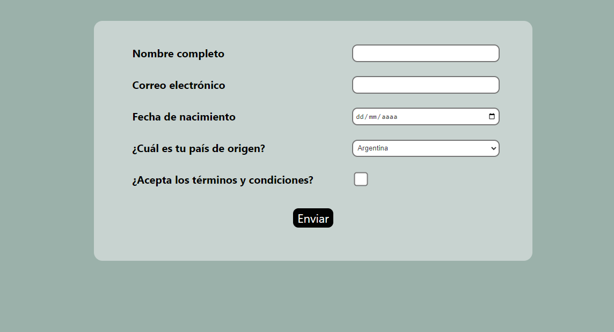
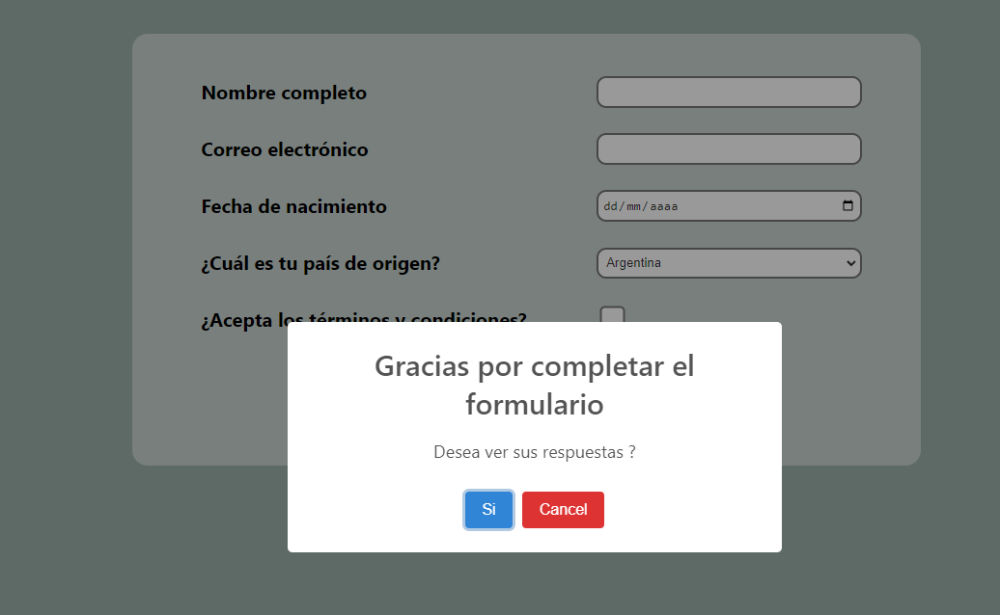
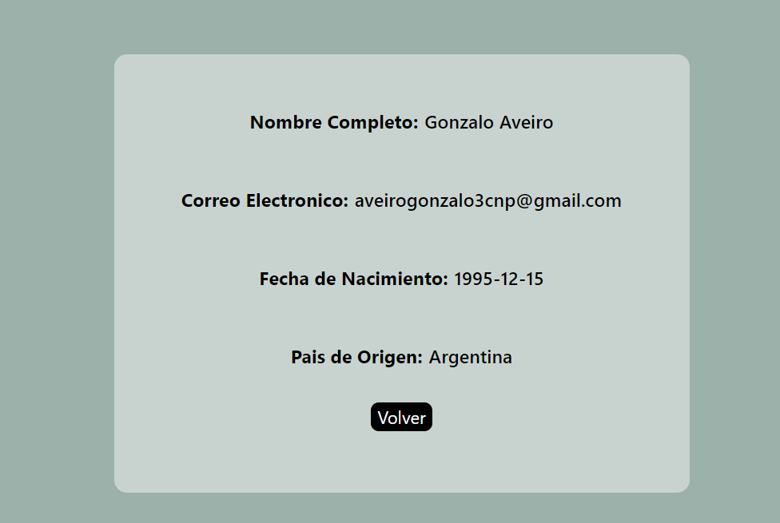

Challenge greydive

Hola a todos, les presento un challenge que realice para la empresa greydive.
El mismo se trata de un simple formulario generado a traves de un archivo JSON en el mismo podemos llenar nuestros datos:

<li>Nombre Completo</li>
<li>Correo Electronico</li>
<li>Fecha de nacimiento</li>
<li>Pais de origen</li>
<li>Checkbox para aceptar terminos y condiciones</li>
 

Una vez que hemos completados los datos y apretamos el boton enviar, nos saldra un cartel que nos preguntara si queremos ver nuestras respuestas.
 

 

Si hacemos click en Si, nos redirigira a otra ruta donde se mostraran los datos que hemos completado anteriormente.
 

 
Tecnologias usadas:

<li>JavaScript</li>
<li>React</li>
<li>Firebase</li>
<li>sweetalert2</li>
<li>CSS</li>
 
La aplicacion esta deployada en vercel

Link del deploy:
